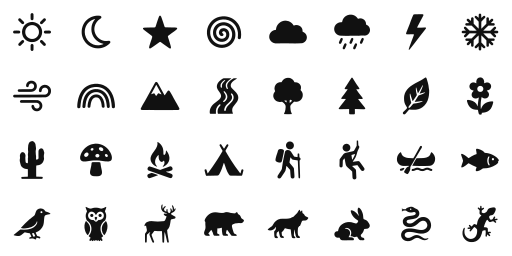
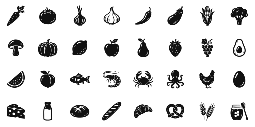
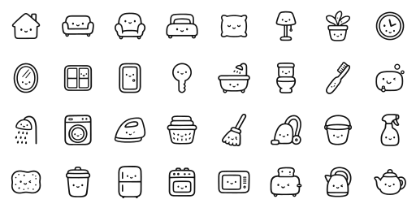

# Artifisio Icons Registry

This repository is the **open-source icon registry** for [Artifisio](https://artifisio.com) — coherent icon families as plain, themeable SVGs on a fixed grid, distributed via a developer CLI.

> **Auto-generated.** Maintained by Artifisio's sync pipeline. Do not send pull requests — [open an issue](../../issues) instead.

---

## ✨ Featured sets

Every icon is a themeable SVG on a consistent grid — click any set to browse the full collection.

<p align="center">
<a href="sets/petroglyph-trail"></a>
<br />
<strong><a href="sets/petroglyph-trail">Petroglyph Trail</a></strong><br />
<sub>62 icons · 24px grid · petroglyph · outdoors · primitive · solid</sub><br /><br />
<code>npx artifisio add petroglyph-trail --kind icon</code>
</p>

<p align="center">
<a href="sets/linocut-market"></a>
<br />
<strong><a href="sets/linocut-market">Linocut Market</a></strong><br />
<sub>62 icons · 24px grid · linocut · food · handmade · solid</sub><br /><br />
<code>npx artifisio add linocut-market --kind icon</code>
</p>

<p align="center">
<a href="sets/housemates"></a>
<br />
<strong><a href="sets/housemates">Housemates</a></strong><br />
<sub>62 icons · 24px grid · kawaii · home · cute · outline</sub><br /><br />
<code>npx artifisio add housemates --kind icon</code>
</p>

---

## Install via CLI

```bash
# Find a set
npx artifisio search "<vibe>" --kind icon

# Add a set to your project (writes the SVGs, a typed index and ATTRIBUTION.md)
npx artifisio add <set-slug> --kind icon

# Recolour at install time
npx artifisio add <set-slug> --kind icon --colors "ink=#4A7CFF"
```

Icons land in `./public/icons/<set-slug>/`. The CLI writes a `.artifisiorc.json` pinning each set's registry `version` and `manifestHash` for reproducible installs.

---

## Direct CDN usage (jsDelivr)

```html
/svg/<icon>.svg" width="24" />
```

Pin to a registry release for reproducible builds: `https://cdn.jsdelivr.net/gh/artifisio/icons@v2026.10.05-1735-cbf8220/sets/<set-slug>/svg/<icon>.svg`.

---

## Theming

Monochrome sets carry a single themeable `ink` slot and are written as `fill="var(--artf-ink, currentColor)"`, so they inherit the surrounding text colour by default and re-theme with one CSS variable:

```css
.icon { color: #334155; }              /* inherited via currentColor */
.icon-brand { --artf-ink: #4A7CFF; }   /* or override the slot directly */
```

Duotone sets expose `ink` plus measured `accent-*` slots; every slot is listed in each set's `meta.json` `palette`.

---

## Available sets (15 sets · 960 icons)

| Name | Slug | Icons | Grid | Stroke | Themeable slots | Tags |
| ---- | ---- | ----- | ---- | ------ | --------------- | ---- |
| [Petroglyph Trail](sets/petroglyph-trail) | `petroglyph-trail` | 62 | 24px | 2 | ink | petroglyph, outdoors, primitive, solid |
| [Linocut Market](sets/linocut-market) | `linocut-market` | 62 | 24px | 2 | ink | linocut, food, handmade, solid |
| [Housemates](sets/housemates) | `housemates` | 62 | 24px | 2 | ink | kawaii, home, cute, outline |
| [Kitchen Alchemy](sets/kitchen-alchemy-ii) | `kitchen-alchemy-ii` | 14 | 24px | 2 | ink, accent | kitchen, cooking, whimsical, duotone |
| [Bitmap](sets/bitmap-3) | `bitmap-3` | 34 | 24px | 2 | ink | pixel, retro, lo-fi, solid |
| [Gaffer](sets/gaffer-2) | `gaffer-2` | 33 | 24px | 2 | ink, accent-1, accent-2 | tape, collage, handmade, duotone |
| [Bitmap](sets/bitmap-2) | `bitmap-2` | 34 | 24px | 2 | ink | pixel, retro, lo-fi, solid |
| [Pulse](sets/pulse) | `pulse` | 142 | 24px | 2 | ink | health, medical, wellness, outline |
| [Constellation](sets/constellation) | `constellation` | 142 | 24px | 2 | ink | stars, night, celestial, outline |
| [Stack](sets/stack) | `stack` | 141 | 24px | 2 | ink | developer, cloud, data, outline |
| [Cross Stitch · GPT Image 2](sets/cross-stitch-gpt2) | `cross-stitch-gpt2` | 34 | 24px | 2 | ink | embroidery, stitch, cosy, outline, gpt2 |
| [Whiskers](sets/whiskers) | `whiskers` | 34 | 24px | 2 | ink | cat, pets, playful, outline, gpt2 |
| [Meltdown · GPT Image 2](sets/meltdown-gpt2) | `meltdown-gpt2` | 34 | 24px | 2 | ink | melting, liquid, playful, ui, gpt2 |
| [Drafting Table · Nano Banana 2 (Flash)](sets/drafting-table-nb2) | `drafting-table-nb2` | 34 | 24px | 2 | ink, accent-1, accent-2 | blueprint, technical, engineering, duotone, nb2 |
| [UI Essentials](sets/ui-essentials) | `ui-essentials` | 98 | 24px | 2 | ink | ui, outline, essentials |

Each set directory holds `meta.json` (grid, stroke, palette, sha256 per file) next to `svg/` and a `preview.svg` contact sheet.

---

## License

All icons here are licensed under [CC BY 4.0](LICENSE): use them commercially, modify them and redistribute them, keeping the credit. Attribution text lives in every set's `license.attribution`; `npx artifisio add` writes it to `ATTRIBUTION.md` for you.

---

## Registry details

| Field | Value |
| --- | --- |
| Registry version | `2026.10.05-1735-cbf8220` |
| CLI | [`artifisio`](https://www.npmjs.com/package/artifisio) |
| License | [CC BY 4.0](LICENSE) |
| Other kinds | [`index.json`](index.json) lists every per-kind registry (illustrations, fonts) |
| For agents | [`llms.txt`](llms.txt) |

Icons are generated and curated at [artifisio.com](https://artifisio.com).
